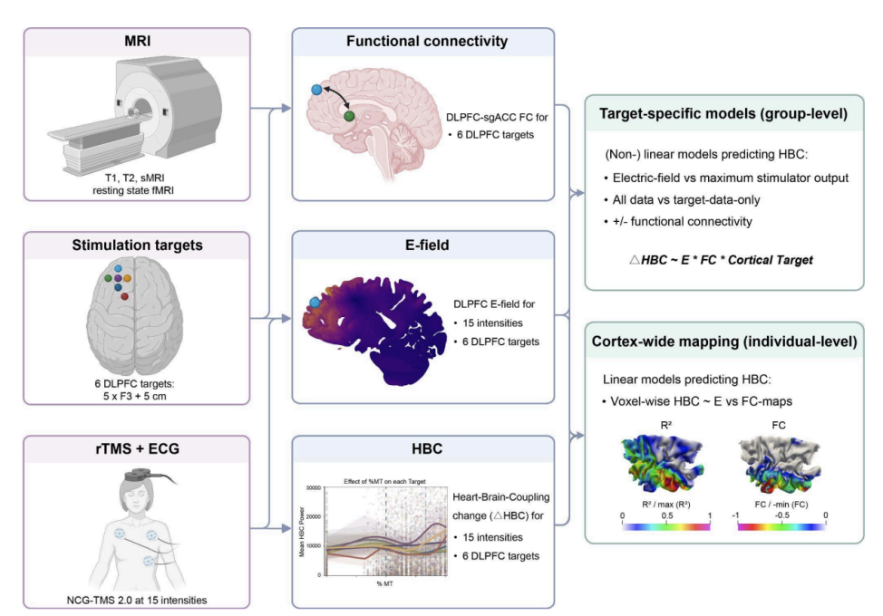

刺激线圈作为TMS设备最为核心的结构组成。在长期的发展中，刺激线圈已经从最初的圆形线圈、八字线圈，发展到Brainsway研发的H型深部线圈。在大量的研究中发现H型深部线圈在治疗效果上比常规线圈更好，这让研究者思考：深部线圈与常规线圈在疗效上的差异是因为什么？难道在最基础的病理学机制上两者是否有什么差异吗？

然而，在我实际的文献研究和临床实际中，***深部线圈与常规线圈其实本质上没有差异，他们都是TMS技术，原理机制相同***。那么为什么两者会有这样的差异呢？该问题可以从以下角度分析：

## 鲁棒性

常规线圈在治疗过程中使用的常常为5cm法，这个方法虽然简单，但存在一定的脱靶率（9%~33%）[^ref1] [^ref2]。而深部线圈因为刺激深度更深，同时刺激面也更广，从而脱靶率更低。这个观点似乎过于简单直接了，但却十分符合直觉！
在实际的临床操作过程中，由于TMS的操作繁琐，使用门槛较高，有相当一部分操作师操作是不规范的，即使是研究者也无法100%准确定位。而深部线圈刺激面积更大，对操作师容忍度更高。从这种角度而言，深部磁刺激与导航磁刺激解决了相同的问题“更有效刺激目标靶点”。

## 刺激充分性

由于刺激深度更深，相较于常规线圈，深部线圈能够同时刺激脑沟与脑回区域，可以更充分地刺激脑区。

## 耐受性
我们看下两类线圈在耐受的差异：相同深度下常规线圈在表明堆积的电能更多，输入能量越大。要保证耐受，就需要在相对均匀地传递能量。刺激的过程是能量传递的过程，患者的耐受从能量水平上理解就是：在刺激相同深度的前提下，整体的能量要越低越好。

[^ref3]

## 参考文献
[^ref1]: JOHNSON K A, BAIG M, RAMSEY D, et al. Prefrontal rTMS for treating depression: Location and intensity results from the OPT-TMS multi-site clinical trial[J]. Brain Stimulation, 2013, 6(2): 108-117. DOI: 10.1016/j.brs.2012.02.003.
[^ref2]:JOHNSON K, RAMSEY D, KOZEL… F. Using imaging to target the prefrontal cortex for transcranial magnetic stimulation studies in treatment-resistant depression[J/OL]. Dialogues in clinical …, - pmc.ncbi.nlm.nih.govKA Johnson, D Ramsey, FA Kozel, DE Bohning, B Anderson, Z Nahas, HA Sackeïm…Dialogues in clinical neuroscience, 2006•pmc.ncbi.nlm.nih.gov, 2006. [2026-08-11]. https://pmc.ncbi.nlm.nih.gov/articles/PMC3181765/.
[^ref3]:FENG Z, MARTIN S, GERARDOS G, et al. Cortical Stimulation Strength and sgACC Connectivity Shape Neuro‑Cardiac Responses to Prefrontal TMS[J]. bioRxiv, - biorxiv.orgZ Feng, S Martin, G Gerardos, K Weise, G Hartwigsen, T Knösche, O NumssenbioRxiv, 2026•biorxiv.org, 2026. DOI: 10.64898/2026.05.10.724073.