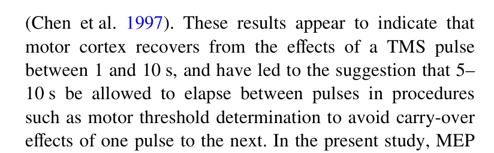

## TMS频率与疗效方向

一般而言，TMS刺激分为高频刺激（大于5Hz）和低频刺激（小于等于1Hz），其中高频刺激用于易化皮层组织，而低频用于抑制皮层活动。常规处理方式就是，哪里有问题就打哪里，而深层区有问题就通过神经网络间接调节。

## 实操过程中单脉冲刺激的间隔

上面的那个疗效方向很简单，学习TMS的第一课就会讲到这个部分。但在培训过程中，我们会发现一个问题：如果说不同的刺激频率会出现神经调控的作用，那么我在阈值评定的时候，其实会采用多次单脉冲来寻找靶点和强度，那么这个寻找的过程是否也算是一种治疗呢？
答案：是的。但不能完全是。一般的治疗过程中，刺激频率是由程序控制的连续的多脉冲刺激，刺激脉冲数一般不小于1000次，而评估过程中的单脉冲刺激过程前一个脉冲的确会影响到后一个脉冲刺激。

[^ref1]
在上述截图中的文献研究中，明确指出：一个脉冲所带来的影响会在1-10s消失，而在具体使用过程中推荐5-10s来消除前一个脉冲对后一个脉冲的影响。因此，你会在很多文献中看到，在评估运动阈值时刺激间隔常设定为5s。

## 参考文献
[^ref1]: LUBER B, BALSAM P, NGUYEN T, et al. Classical conditioned learning using transcranial magnetic stimulation[J]. Experimental Brain Research, 2007, 183(3): 361-369. DOI: 10.1007/s00221-007-1052-7.