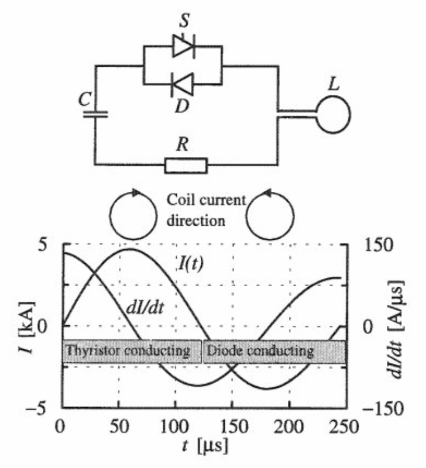

## 经颅磁刺激核心结构
>经颅磁刺激设备是通过内部的高压电容快速向线圈放电，从而在线圈周围产生感应磁场，磁场会无损穿透人体，从而在颅骨内部脑组织产生感应电场，最终实现刺激。

上面这段文字会在其他TMS的相关知识卡片中不断出现，这是一个关于经颅磁刺激作用原理的描述。从这种原理中，我们不难总结出：经颅磁刺激对于设备硬件的核心要点其实只有一个***时变脉冲电流的释放***。
[^ref1]
为了实现这个效果，电路中核心组件可以分为：电源、电容、放电模块以及电感。
- 电源：这是一个直接与市电连接的核心组件之一，在中国，是220V市电。但电源并不是直接与电容相连，实现对电容的快速充电。由于电容释放是高压（一般在2000V），220V的市电又存在一定的不稳定形。因此，在电源部分上TMS总是通过PFC（功率因子校正电路），将220V交流电转为380V的高压直流对电容充电。
    - 电源的好坏决定了电容的充电时间快慢，直接决定了设备所支持的最高刺激频率。有些厂家为了实现设备可在100%强度下输出100Hz（脉冲无衰减前提），但由于自身设计和硬件本身的限制，单个电源和电容无法快速实现这个频率和强度。此时，最简单的方式，就是将设计多个电源，甚至配套多电容，最终对单个线圈拍快速放电。

- 电容：电容是整个设备的储能单元，它就像一个蓄水池，放电电路就是个泄水阀，当蓄水池中的水（电能）越高，则泄水阀打开后就会产生越强的水流。这个例子似乎暗示着电容这个蓄水池越大越好？答案是否定的。在当代科学设计理念中，绝大多数表面看上去通过做加法的形式提高的某种能量是存在边界递减效应的。在电容上，电容储能越大，意味着充电时间越长，对充电模组的要求越高；同时，在临床使用上，并不需要非常高的电压（一般是2000V），过高的电压设定意味着操作者刺激强度调节的颗粒度过大（上位机调节强度是百分比调节）。
    - 值得注意的是：开发设计采用的电容额定电压是2000V，但并不意味着我在上位机设定的100%强度就对应着最大电压，一定要注意**余量控制**。

- 放电模块：放电模块核心在于FPGA+可控硅/IGBT，其中可控硅/IGBT就是上文提到的电容这个蓄水池的“泄水阀”，它是一个开关，一个让电能释放的开关。FPGA则是以μs级控制这个开关的开放时序，这个时序就是刺激频率的最直接体现。放电模块通常需要综合上位机设定强度和电容充电情况来设定“强度-频率关系表”。

- 电感：在设备结构组成上称为“刺激线圈”，刺激线圈是由多扎铜线/管缠绕而成。它是TMS的应用部分，与人体直接接触。
    - 电感本身就会储存电能，在电容单次放电结束后，电感会反向对电容进行充电。整个过程形成双相脉冲波形（如上图）。如果要实现单相波就需要解决这个电感方向充电的情况。

# 参考文献
[^ref1]: ILMONIEMI F, RUOHONEN J, KARHU J. Transcranial magnetic stimulation–A new tool for functional imaging[J/OL]. Crit. Rev. Biomed. Eng, 1999. [2026-08-12]. https://www.academia.edu/download/46400777/Transcranial_magnetic_stimulation--a_new20160611-11614-97hvm0.pdf.